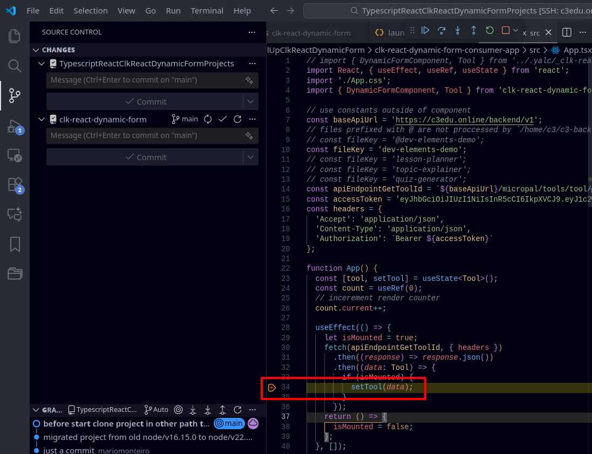
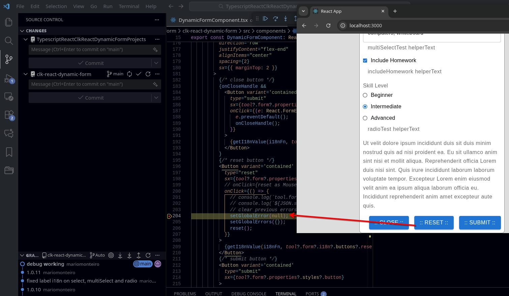

# TLDR

- [TLDR](#tldr)
  - [Dual Repo Notes](#dual-repo-notes)
  - [Requirements](#requirements)
  - [Clone Projects](#clone-projects)
  - [open Vscode at](#open-vscode-at)
  - [Dev Environment](#dev-environment)
    - [Start Dev Env](#start-dev-env)
    - [Debug](#debug)
      - [Add Breakpoints](#add-breakpoints)
  - [Always use git scripts to work with dual projects git](#always-use-git-scripts-to-work-with-dual-projects-git)
  - [Build and use package with c3-frontend consumer](#build-and-use-package-with-c3-frontend-consumer)
    - [c3-frontend](#c3-frontend)
      - [To use new package code/updated c3-frontend](#to-use-new-package-codeupdated-c3-frontend)
    - [now in Package clk-react-dynamic-form](#now-in-package-clk-react-dynamic-form)

## Dual Repo Notes

warn this project is splitted in two distintict projects

- [TypescriptReactClkReactDynamicFormProjects](https://github.com/koakh/TypescriptReactClkReactDynamicFormProjects.git)

  this have all things, less `clk-react-dynamic-form`, we only expose `clk-react-dynamic-form` to critical-links repo, leaving all other things in privat project

- [clk-react-dynamic-form](https://bitbucket.org/criticallinksteam/clk-react-dynamic-form/src/main/)

  critical-links repo `clk-react-dynamic-form`

- /home/c3/TypescriptReactClkReactDynamicFormProjects/.git/config
  .git/config

- /home/c3/TypescriptReactClkReactDynamicFormProjects/NewRollUpClkReactDynamicForm/clk-react-dynamic-form/.git/config

## Requirements

```shell
$ node -v
v22.14.0
```

## Clone Projects

```shell
# clone main project TypescriptReactClkReactDynamicFormProjects
$ git clone https://github.com/koakh/TypescriptReactClkReactDynamicFormProjects.git
# enter path
$ cd TypescriptReactClkReactDynamicFormProjects/NewRollUpClkReactDynamicForm

# clone clk-react-dynamic-form clk package project
$ git clone https://mariomonteiro@bitbucket.org/criticallinksteam/clk-react-dynamic-form.git
# back path
$ cd ..
$ tree -L 3
├── NewRollUpClkReactDynamicForm
│   ├── clk-react-dynamic-form
│   ├── clk-react-dynamic-form-consumer-app

# Navigate into the workspace root and install. This will link all the packages (including rollup and react-hook-form) correctly across your library and your consumer app.
$ cd ~/TypescriptReactClkReactDynamicFormProjects/NewRollUpClkReactDynamicForm
$ pnpm i
# Verify the react-hook-form Version
# Once the install finishes, let's verify exactly what version the workspace has decided to use. Run this from the same folder:   
$ pnpm list react-hook-form --recursive
```

## open Vscode at

- `/home/c3/TypescriptReactClkReactDynamicFormProjects`

## Dev Environment

### Start Dev Env

```shell
# term1
$ pnpm --filter clk-react-dynamic-form watch
# or
$ pnpm start:dev
rollup v3.29.4
bundles src/index.ts → dist/index.js, dist/index.esm.js...
created dist/index.js, dist/index.esm.js in 7s
[2026-01-16 12:40:43] waiting for changes...

# term2
$ pnpm --filter clk-react-dynamic-form-consumer-app start
# or
$ pnpm start:app
Compiled successfully!

You can now view clk-react-dynamic-form-consumer-app in the browser.

  Local:            http://localhost:3000
  On Your Network:  http://192.168.122.243:3000

Note that the development build is not optimized.
To create a production build, use npm run build.

webpack compiled successfully
No issues found.
```

### Debug

#### Add Breakpoints

add breakpoint here `e.target.reset();`

```ts
  // OPT #2
  const onSubmit = (data: any, e: any, tool: Tool) => {
    // reset after form submit
    e.target.reset();
    // required react hook form reset to
    reset();
    // console.log(`onSubmit data: ${JSON.stringify(data)}`);
    let payload = data;
```

or here `setGlobalError(null);`, this is the better place, after all renders are done, and form are ready to work

```tsx
          {/* reset button */}
          <Button variant='contained'
            type="reset"
            sx={tool?.form?.properties?.styles?.button}
            // onClick={reset as MouseEventHandler<HTMLButtonElement>}
            onClick={() => {
              // console.log(`tool.form?.elements: [${JSON.stringify(tool.form?.elements, undefined, 2)}]`);
              // console.log(`${JSON.stringify(tool.form?.elements?.find(e => e.key === 'subject')?.defaultValue, undefined, 2)}`);
              // clear previous errors
              setGlobalError(null);
              setGlobalErrors({});
              reset();
            }}
          >
            {getI18nValue(i18nFn, tool?.form?.i18n?.buttons?.reset, 'Reset')}
          </Button>
```

now launch the debugger with F5





all done debug works in **consumer app** and in **package**

## Always use git scripts to work with dual projects git

- Commit/Push All:`pnpm git:sync "feature: added forms"`
- Pull All: `pnpm git:pull`
- Checkout Branch (All): `pnpm git:checkout main`
- Sync Only Child: `pnpm git:sync "fix: child component" child`
- Sync Only Root: `pnpm git:sync "chore: update root" root`

## Build and use package with c3-frontend consumer

### c3-frontend

```shell
$ git clone https://bitbucket.org/criticallinksteam/c3-frontend
$ cd c3-frontend
$ git checkout develop
$ npm i --legacy-peer-deps
```

now in frontend

```shell
# yalc add clk-react-dynamic-form@1.0.11
# now always use link, this is the trick

# if we use add we need to remove it first, after we have publish it in clk-react-dynamic-form with `"build:publish:push"` script
$ yalc remove clk-react-dynamic-form

# now link it
# yalc link clk-react-dynamic-form@1.0.11
# this fix cache problems, like webpack using cached `clk-react-dynamic-form`, and we change `clk-react-dynamic-form` and nothing change in consumer app
$ yalc link clk-react-dynamic-form
Package clk-react-dynamic-form@1.0.11 linked ==> /tmp/c3-frontend/node_modules/clk-react-dynamic-form
```

great news: `yalc link` doesn't change `"clk-react-dynamic-form": "^1.0.11"` in `package.json`

Use `yalc link` instead of `yalc add`

There is a subtle difference:

- `yalc add` copies files and changes package.json.
- `yalc link` creates a symlink.

> Often, development servers track symlinks more aggressively. Try this in your consumer app

`yalc link` makes all the magic it even works with hotreload, now whwn I change something in package I just need to

optionaly add to `config-overrides.js`

```js
const webpack = require('webpack');

// require env here
module.exports = function override(config, env) {

  ...

  // clk-react-dynamic-form
  if (env === 'development') {
    // disable "managedPaths" for your package
    // this tells Webpack: "Don't assume node_modules/clk-react-dynamic-form is immutable"
    config.snapshot = {
      ...config.snapshot,
      managedPaths: [
        /^(.+?[\\/]node_modules[\\/])(?!clk-react-dynamic-form)/
      ],
    };

    // ensure the cache is invalidated if the .yalc folder changes
    config.cache = {
      type: 'filesystem',
      buildDependencies: {
        config: [__filename],
        // invalidate cache if yalc.lock changes
        yalc: ['./yalc.lock'] 
      },
    };
  }
}
```

now run `start:debug` script

```shell
$ npm run start:debug
```

launch debugger with `F5` top open window

> to debug the package always ue the `clk-react-dynamic-form-consumer-app`

#### To use new package code/updated c3-frontend

just publish it with

```shell
$ cd NewRollUpClkReactDynamicForm/clk-react-dynamic-form
$ pnpm build:publish:push
src/index.ts → dist/index.esm.js...
created dist/index.esm.js in 4.9s
clk-react-dynamic-form@1.0.11 published in store.
clk-react-dynamic-form@1.0.11 published in store.
Pushing clk-react-dynamic-form@1.0.11 in /home/c3/c3-frontend
Package clk-react-dynamic-form@1.0.11 linked ==> /home/c3/c3-frontend/node_modules/clk-react-dynamic-form
```

### now in Package clk-react-dynamic-form

change some visible thing to prove that c3-frontend will get changes from package

- `NewRollUpClkReactDynamicForm/clk-react-dynamic-form/src/components/DynamicFormComponent.tsx`

for ex change

```tsx
{getI18nValue(i18nFn, tool?.form?.i18n?.buttons?.reset, 'Reset')}
```

to

```tsx
{/* {getI18nValue(i18nFn, tool?.form?.i18n?.buttons?.reset, 'Reset')} */}
CHANGED
```

```shell
$ cd NewRollUpClkReactDynamicForm/clk-react-dynamic-form
$ pnpm build:publish:push

src/index.ts → dist/index.esm.js...
created dist/index.esm.js in 4.6s
clk-react-dynamic-form@1.0.11 published in store.
clk-react-dynamic-form@1.0.11 published in store.
Pushing clk-react-dynamic-form@1.0.11 in /home/c3/c3-frontend
Package clk-react-dynamic-form@1.0.11 linked ==> /home/c3/c3-frontend/node_modules/clk-react-dynamic-form
```

> we see here c3-frontend project after we add it and re-build it with `pnpm build:publish:push`, ex `/home/c3/c3-frontend/node_modules/clk-react-dynamic-form`

and without touch anything I see the buttons change with hotreload

sometimes we need a refresh, hot reload will not work, but is good for me the way it works
but when it works, it always works, like we can make as many changes as we like in package and it will always reload and show changes

That is fantastic news! Switching from `yalc add` to `yalc link` is the "secret sauce" for hot reloading because it creates a symbolic link that the Webpack file watcher can follow directly.